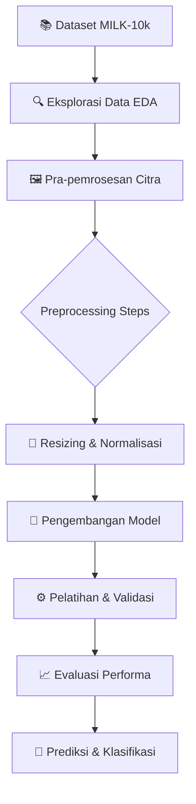

<div align="center">

# 🔬 Deteksi Otomatis Kanker Kulit

## *Analisis Citra Lesi Kulit Multimodal*


---

*Sebuah proyek penelitian untuk mengembangkan model deep learning yang mampu mengklasifikasikan jenis kanker kulit dari citra medis.*

</div>

## 🎯 **Overview**

> Proyek ini bertujuan untuk membangun sebuah sistem cerdas yang dapat **mendeteksi dan mengklasifikasikan tujuh jenis lesi kulit berbeda** secara otomatis, termasuk lesi ganas seperti Melanoma (MEL) dan Karsinoma Sel Basal (BCC). Dengan memanfaatkan dataset citra multimodal **MILK-10k**, sistem ini dirancang untuk menjadi alat bantu diagnosis bagi para profesional medis.

<table>
<tr>
<td width="50%">

### 📊 **Spesifikasi Proyek**

- **📚 Dataset**: MILK-10k
- **🧠 Domain**: Medical AI, Computer Vision
- **🎯 Fokus**: Klasifikasi Kanker Kulit
- **🖼️ Total Citra**: 10,000+
- **🐍 Libraries**: Pandas, Seaborn, Matplotlib, PIL
- **📓 Environment**: Jupyter Notebook

</td>
<td width="50%">

### 🔗 **Quick Links**

- 📂 **[Folder Dataset](dataset/)**
- 📓 **[Notebook Analisis (EDA)](main.ipynb)**
- 📝 **[Dependencies](requirements.txt)**
- 📜 **[Lisensi MIT](LICENSE)**

</td>
</tr>
</table>

---

## 📁 **Struktur Repositori**

```
📦 Deteksi-Otomatis-Kanker-Kulit/
├── 📂 dataset/
│   ├── 📂 MILK10k_Test_Input/
│   ├── 📂 MILK10k_Training_Input/
│   ├── 📄 MILK10k_Test_Metadata.csv
│   ├── 📄 MILK10k_Training_GroundTruth.csv
│   └── 📄 MILK10k_Training_Supplement.csv
│
├── 📓 main.ipynb               # Notebook utama untuk EDA & Preprocessing
├── 📄 requirements.txt         # Daftar dependensi Python
└── 📄 README.md                # Dokumentasi ini
```

<div align="center">

### 🏗️ **Alur Kerja Proyek**



</div>

## 📊 **Spesifikasi Metadata (`GroundTruth.csv`)**

File metadata berisi label untuk setiap gambar, yang dikodekan dalam format *one-hot encoding*.

<div align="center">
<table>
<thead>
<tr style="background: linear-gradient(45deg, #02aab0 0%, #00cdac 100%); color: white;">
<th>🏷️ Field</th>
<th>📝 Deskripsi</th>
<th>📄 Tipe Data</th>
<th>📊 Contoh Data</th>
</tr>
</thead>
<tbody>
<tr>
<td><strong>lesion_id</strong></td>
<td>ID unik untuk setiap lesi kulit</td>
<td>String</td>
<td>IL_0000000</td>
</tr>
<tr style="background-color: #f8f9fa;">
<td><strong>AKIEC</strong></td>
<td>Actinic Keratoses</td>
<td>Float (0.0/1.0)</td>
<td>1.0</td>
</tr>
<tr>
<td><strong>BCC</strong></td>
<td>Basal Cell Carcinoma</td>
<td>Float (0.0/1.0)</td>
<td>0.0</td>
</tr>
<tr style="background-color: #f8f9fa;">
<td><strong>BKL</strong></td>
<td>Benign Keratosis-like Lesions</td>
<td>Float (0.0/1.0)</td>
<td>0.0</td>
</tr>
<tr>
<td><strong>DF</strong></td>
<td>Dermatofibroma</td>
<td>Float (0.0/1.0)</td>
<td>0.0</td>
</tr>
<tr style="background-color: #f8f9fa;">
<td><strong>MEL</strong></td>
<td>Melanoma</td>
<td>Float (0.0/1.0)</td>
<td>0.0</td>
</tr>
<tr>
<td><strong>NV</strong></td>
<td>Melanocytic Nevi</td>
<td>Float (0.0/1.0)</td>
<td>0.0</td>
</tr>
<tr style="background-color: #f8f9fa;">
<td><strong>VASC</strong></td>
<td>Vascular Lesions</td>
<td>Float (0.0/1.0)</td>
<td>0.0</td>
</tr>
</tbody>
</table>
</div>

## 🚀 **Potensi Aplikasi**

<div align="center">
<table>
<tr>
<td align="center" width="25%">

<h4><strong>Alat Bantu Diagnosis</strong></h4>
<p><em>Membantu dermatologis dalam skrining awal dan identifikasi lesi yang mencurigakan.</em></p>
</td>
<td align="center" width="25%">

<h4><strong>Aplikasi Telemedicine</strong></h4>
<p><em>Integrasi ke dalam platform kesehatan digital untuk konsultasi jarak jauh.</em></p>
</td>
<td align="center" width="25%">

<h4><strong>Penelitian Medis</strong></h4>
<p><em>Menjadi dasar untuk analisis tren penyakit kulit dan pengembangan metode deteksi baru.</em></p>
</td>
<td align="center" width="25%">

<h4><strong>Edukasi Publik</strong></h4>
<p><em>Meningkatkan kesadaran masyarakat akan pentingnya deteksi dini kanker kulit.</em></p>
</td>
</tr>
</table>
</div>

## 🛠️ **Metodologi**

<div align="center">

### 🔄 **Pipeline Pra-pemrosesan Data**

```
📥 Input Citra Asli → 🖼️ Ubah Ukuran (Resize) → 🎨 Konversi Warna → 🔢 Normalisasi Piksel → ✅ Output Siap Latih
```

</div>

> **Proses Kunci**: Setiap gambar dalam dataset melewati serangkaian langkah pra-pemrosesan yang krusial untuk memastikan konsistensi dan meningkatkan performa model. Proses ini distandarisasi untuk semua citra, baik klinis maupun dermoskopik.

<details>
<summary><strong>🔍 Detail Langkah Pra-pemrosesan</strong></summary>

- ✅ **Image Resizing**: Semua gambar diubah ukurannya menjadi dimensi yang seragam (misal, 224x224 piksel) untuk memenuhi persyaratan input model.
- ✅ **Color Conversion**: Memastikan semua gambar berada dalam format warna yang konsisten (RGB).
- ✅ **Pixel Normalization**: Nilai piksel gambar (awalnya 0-255) dinormalisasi ke rentang yang lebih kecil (misal, 0-1) untuk menstabilkan proses pelatihan.

</details>

## 👤 **Peneliti**

<div align="center">
<table>
<tr>
<td align="center" width="100%">

<br>
<strong>Bayu Ardiyansyah</strong>
</td>
</tr>
</table>
</div>

## 📜 **Lisensi**

<div align="center">

[](https://opensource.org/licenses/MIT)

</div>

> Proyek ini dilisensikan di bawah Lisensi MIT. Anda bebas untuk menggunakan, memodifikasi, dan mendistribusikan kode ini untuk tujuan apa pun, baik komersial maupun non-komersial.

<div align="center">

### 🤝 **Kontribusi & Feedback**

*Proyek ini merupakan inisiatif penelitian independen. Saran, kritik, atau peluang kolaborasi sangat kami hargai. Silakan buka issue atau hubungi peneliti secara langsung.*

---

<sub>🔬 **Disclaimer**: Sistem ini adalah alat bantu penelitian dan **bukan** pengganti diagnosis medis profesional. Setiap hasil yang diberikan oleh model harus diverifikasi oleh tenaga medis yang berkualifikasi.</sub>

</div>