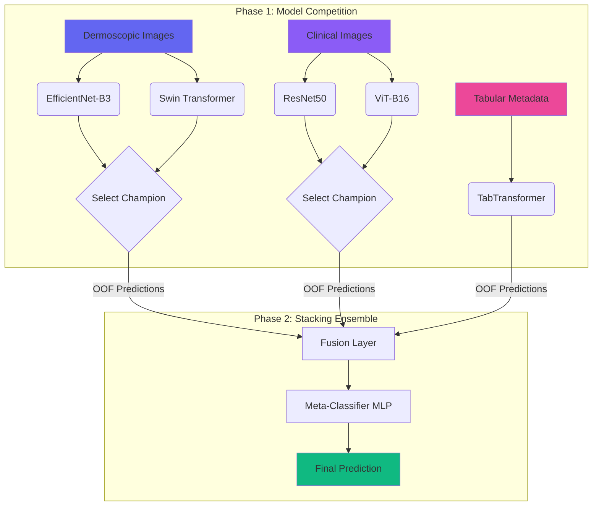

<div align="center">

# 🔬 MILKFusionNet

### *Multimodal Deep Learning Ensemble for Intelligent Skin Lesion Classification*


**[Dataset](https://challenge.isic-archive.com/data/#milk10k)** • **[Documentation](#-getting-started)** • **[Architecture](#-architecture)** • **[License](#-license)**

</div>

---

## 🎯 Overview

**MILKFusionNet** represents a cutting-edge approach to automated skin lesion classification, leveraging the power of multimodal deep learning. By harmoniously combining dermoscopic images, clinical photographs, and tabular metadata from the **ISIC MILK-10k** dataset, this system delivers enhanced diagnostic support for medical professionals.

> **Mission:** Democratizing early skin cancer detection through AI-powered precision, reducing diagnostic subjectivity, and bridging healthcare accessibility gaps worldwide.

---

## 💡 The Challenge

Skin cancer, particularly melanoma, remains a critical global health concern with high mortality rates when diagnosed late. Current diagnostic paradigms face several limitations:

<table>
<tr>
<td width="33%" align="center">

### 🎭 Subjectivity
Heavy reliance on dermatologist experience with limited availability in underserved regions

</td>
<td width="33%" align="center">

### 📊 Data Imbalance
Severe class imbalance in medical datasets causing model bias toward common conditions

</td>
<td width="33%" align="center">

### 🔍 Unimodal Limitations
Most AI systems analyze single image types, missing contextual clinical information

</td>
</tr>
</table>

---

## 🏗️ Architecture

MILKFusionNet employs a **two-phase ensemble strategy** that orchestrates multiple deep learning architectures:




</details>

<br>

<div align="center">

| 🎯 **Phase 1: Model Competition** | 🔗 **Phase 2: Ensemble Fusion** |
|:----------------------------------|:--------------------------------|
| Train CNN & Transformer models separately for each modality | Combine champion predictions using intelligent meta-learning |
| **Dermoscopic:** EfficientNet-B3 vs Swin Transformer | **Fusion Layer:** Concatenates probability vectors |
| **Clinical:** ResNet50 vs ViT-B16 | **Meta-Classifier:** MLP learns optimal combination |
| **Tabular:** TabTransformer for metadata | **Output:** Final prediction across 11 classes |

</div>

### 🎨 Design Philosophy

| Component | Purpose | Technology |
|:----------|:--------|:-----------|
| **CNN Models** | Capture spatial hierarchies & local patterns | EfficientNet-B3, ResNet50 |
| **Transformers** | Model global context & long-range dependencies | Swin Transformer, ViT-B16 |
| **Tabular Model** | Process patient metadata & clinical markers | TabTransformer |
| **Meta-Learner** | Intelligent probability fusion & final decision | Multi-Layer Perceptron |

---

## 📊 Dataset Overview

### ISIC MILK-10k Dataset

The **MILK-10k (Metadata-Informed Lesion Knowledge)** dataset is a comprehensive multimodal collection for skin lesion classification, containing over 10,000 cases with rich metadata and dual imaging modalities.

<details>
<summary><b>🗂️ Dataset Statistics & Distribution</b></summary>

<br>

#### Dataset Composition

| Split | Total Cases | Dermoscopic Images | Clinical Images | Metadata Records |
|:------|:------------|:-------------------|:----------------|:-----------------|
| **Training** | ~8,000 | ✅ Available | ✅ Available | ✅ Complete |
| **Testing** | ~2,000 | ✅ Available | ✅ Available | ✅ Complete |
| **Total** | **~10,000** | **10,000+** | **10,000+** | **10,000+** |

</details>

<details>
<summary><b>🎯 Class Distribution (11 Diagnostic Categories)</b></summary>

<br>

The dataset includes 11 distinct skin lesion types with varying prevalence:

| Class | Diagnosis | Abbr. | Approx. Samples | Severity | Description |
|:-----:|:----------|:------|:----------------|:---------|:------------|
| **0** | Actinic Keratosis | AK | ~600 | ⚠️ Pre-cancerous | Rough, scaly patches from sun exposure |
| **1** | Basal Cell Carcinoma | BCC | ~900 | 🔴 Malignant | Most common skin cancer, slow-growing |
| **2** | Benign Keratosis | BKL | ~1,200 | 🟢 Benign | Harmless skin growths (seborrheic keratosis) |
| **3** | Dermatofibroma | DF | ~400 | 🟢 Benign | Firm nodular skin lesions |
| **4** | Melanoma | MEL | ~800 | 🔴 Highly Malignant | Deadliest skin cancer, requires urgent care |
| **5** | Melanocytic Nevus | NV | ~3,500 | 🟢 Benign | Common moles, most prevalent class |
| **6** | Squamous Cell Carcinoma | SCC | ~700 | 🔴 Malignant | Second most common skin cancer |
| **7** | Vascular Lesion | VASC | ~350 | 🟢 Benign | Blood vessel abnormalities (hemangiomas) |
| **8** | Acral Lentiginous Melanoma | ALM | ~150 | 🔴 Highly Malignant | Rare melanoma subtype on extremities |
| **9** | Lentigo Maligna | LM | ~200 | ⚠️ Pre-cancerous | Early melanoma on sun-damaged skin |
| **10** | Merkel Cell Carcinoma | MCC | ~50 | 🔴 Highly Malignant | Rare aggressive neuroendocrine tumor |

**Class Imbalance Ratio:** ~70:1 (Most common: NV | Rarest: MCC)

> 📌 **Note:** This severe imbalance motivates our use of Focal Loss and ensemble strategies to prevent model bias toward common benign lesions.

</details>

<details>
<summary><b>🖼️ Image Modalities & Specifications</b></summary>

<br>

#### Dermoscopic Images
- **Purpose:** High-magnification surface analysis revealing subsurface structures
- **Equipment:** Dermatoscope with polarized/non-polarized light
- **Resolution:** Variable (typically 1024×768 to 6000×4000 pixels)
- **Format:** JPEG
- **Key Features:** Reveals pigment networks, globules, streaks, blue-white veil
- **Clinical Value:** Gold standard for melanoma screening

#### Clinical Images  
- **Purpose:** Contextual macro-view of lesion and surrounding skin
- **Equipment:** Standard digital camera
- **Resolution:** Variable (typically 1024×768 to 4000×3000 pixels)
- **Format:** JPEG
- **Key Features:** Shows lesion size, borders, surrounding erythema
- **Clinical Value:** Provides anatomical context and scale reference

#### Image Characteristics
| Aspect | Dermoscopic | Clinical |
|:-------|:------------|:---------|
| **Magnification** | 10-70× | 1× (macro) |
| **Field of View** | Lesion-focused | Wide anatomical context |
| **Lighting** | Controlled polarized | Natural/flash |
| **Diagnostic Use** | Structural analysis | Overall assessment |

</details>

<details>
<summary><b>📋 Tabular Metadata Attributes</b></summary>

<br>

The dataset includes comprehensive patient and lesion metadata:

#### Patient Demographics
| Attribute | Type | Description | Example Values |
|:----------|:-----|:------------|:---------------|
| `age_approx` | Integer | Patient age (years) | 25, 45, 67, 82 |
| `sex` | Categorical | Biological sex | male, female |
| `anatom_site_general` | Categorical | Body location | torso, lower extremity, upper extremity, head/neck, palms/soles, oral/genital |

#### Lesion Characteristics
| Attribute | Type | Description | Clinical Significance |
|:----------|:-----|:------------|:---------------------|
| `tbp_lv_A` | Float | Total body photography lesion area | Size indicator |
| `tbp_lv_Aext` | Float | Extended lesion area | Growth assessment |
| `tbp_lv_B` | Float | Border irregularity score | Higher = more irregular |
| `tbp_lv_C` | Float | Color variation index | Multicolor lesions |
| `tbp_lv_H` | Float | Hue homogeneity | Color distribution |
| `tbp_lv_Hext` | Float | Extended hue metrics | Advanced color analysis |
| `tbp_lv_L` | Float | Lightness/luminance | Brightness assessment |
| `tbp_lv_Lext` | Float | Extended lightness | Pigmentation depth |
| `tbp_lv_nevi_confidence` | Float | Confidence score for nevus | AI pre-screening score |
| `tbp_lv_norm_border` | Float | Normalized border score | Standardized irregularity |
| `tbp_lv_norm_color` | Float | Normalized color variance | Standardized color metric |
| `tbp_lv_perimeterMM` | Float | Lesion perimeter (mm) | Physical boundary size |
| `tbp_lv_areaMM2` | Float | Lesion area (mm²) | Physical size measurement |
| `tbp_lv_x` | Integer | X-coordinate on body map | Spatial localization |
| `tbp_lv_y` | Integer | Y-coordinate on body map | Spatial localization |
| `tbp_lv_z` | Integer | Z-coordinate (depth) | 3D positioning |

#### Derived Features
| Feature | Calculation | Clinical Relevance |
|:--------|:------------|:-------------------|
| `asymmetry_score` | Computed from A/B metrics | ABCDE rule (Asymmetry) |
| `border_score` | `tbp_lv_B + tbp_lv_norm_border` | ABCDE rule (Border) |
| `color_diversity` | `tbp_lv_C + tbp_lv_norm_color` | ABCDE rule (Color) |
| `diameter_mm` | `√(areaMM2/π) × 2` | ABCDE rule (Diameter) |

> 🏥 **ABCDE Rule:** Clinical mnemonic for melanoma detection (Asymmetry, Border, Color, Diameter, Evolution)

#### Missing Data Handling
- **Age:** Imputed with median age by sex and diagnosis
- **Location:** Imputed with mode (most common anatomical site)
- **Numeric Features:** KNN imputation (k=5) based on similar lesions
- **Missing Rate:** <5% for most attributes, <15% overall

</details>

<details>
<summary><b>🔬 Data Quality & Preprocessing Pipeline</b></summary>

<br>

#### Quality Assurance
- ✅ All images manually reviewed by certified dermatologists
- ✅ Multiple expert consensus for melanoma cases
- ✅ Standardized imaging protocols across collection sites
- ✅ Duplicate detection and removal
- ✅ Artifact filtering (rulers, hair, bubbles)

#### Preprocessing Steps
```python
# Image Pipeline
1. Resize to 224×224 pixels (efficient computation)
2. CLAHE enhancement (clip_limit=3.0)
3. Hair removal algorithm (optional)
4. Color normalization (Reinhard method)
5. Augmentation (rotation, flip, color jitter)
6. Normalization (ImageNet statistics)

# Metadata Pipeline  
1. Outlier detection (IQR method)
2. Missing value imputation
3. Feature scaling (StandardScaler)
4. Categorical encoding (Label/One-Hot)
5. Feature engineering (ABCDE scores)
```

#### Data Splits
- **Stratified Split:** Maintains class distribution across train/val/test
- **Cross-Validation:** 5-fold stratified for robust evaluation
- **Patient-Level Split:** No data leakage (same patient not in train/test)

</details>

---

## 📂 Project Structure

```
📦 MILKFusionNet/
│
├── 📂 dataset/                  # Data mentah (TIDAK TERMASUK DALAM GIT)
│   ├── 📂 MILK10k_Test_Input/
│   ├── 📂 MILK10k_Training_Input/
│   ├── 📄 MILK10k_Test_Metadata.csv
│   ├── 📄 MILK10k_Training_GroundTruth.csv
│   └── 📄 MILK10k_Training_Metadata.csv
│
├── 📂 processed_data/           # File manifest hasil olahan data tabular
│   ├── 📄 train_processed.csv
│   ├── 📄 test_processed.csv
│   └── 📄 train_disk_processed.csv # Manifest untuk gambar yang disimpan di disk
│
├── 📂 processed_images/         # Gambar hasil pra-pemrosesan (TIDAK TERMASUK DALAM GIT)
│   └── 📂 train/
│       ├── 📂 clinical/
│       └── 📂 dermoscopic/
│
├── 📂 notebooks/                # Berisi semua file Jupyter Notebook
│   └── 📄 main.ipynb            # Notebook utama untuk analisis & pemodelan
│
├── 📂 src/                      # Skrip Python (jika ada)
│   ├── 📄 dataset.py            # Kelas dan fungsi untuk memuat data
│   ├── 📄 model.py              # Definisi arsitektur model
│   └── 📄 utils.py              # Fungsi-fungsi pembantu
│
├── 📂 configs/                  # File konfigurasi (opsional)
│   └── 📄 training_config.yaml
│
├── 📄 requirements.txt         # Daftar dependensi Python
├── 📄 LICENSE                  # Lisensi proyek
└── 📄 README.md                # Dokumentasi ini
```

---

## 🛠️ Methodology

### Preprocessing Pipeline

Our preprocessing strategy is meticulously designed based on empirical analysis:

<table>
<tr>
<th width="25%">Technique</th>
<th width="40%">Rationale</th>
<th width="35%">Implementation</th>
</tr>

<tr>
<td><b>🖼️ Resizing</b></td>
<td>Standardizes input dimensions for efficient batch processing</td>
<td><code>Resize(224, 224)</code></td>
</tr>

<tr>
<td><b>✨ CLAHE</b></td>
<td>Adaptive histogram equalization enhances local contrast</td>
<td><code>CLAHE(clip_limit=3.0)</code></td>
</tr>

<tr>
<td><b>🎲 Augmentation</b></td>
<td>Synthetic data diversity prevents overfitting</td>
<td><code>HorizontalFlip, Rotate, ColorJitter</code></td>
</tr>

<tr>
<td><b>📏 Normalization</b></td>
<td>Accelerates convergence & stabilizes training</td>
<td><code>Normalize(ImageNet stats)</code></td>
</tr>
</table>

### Training Strategy

- **Loss Function:** Focal Loss (γ=2, α=0.25) for severe class imbalance
- **Optimizer:** AdamW with weight decay (1e-4)
- **Scheduler:** ReduceLROnPlateau (patience=5, factor=0.5)
- **Cross-Validation:** 5-fold stratified CV for robust evaluation
- **Early Stopping:** Patience of 10 epochs on validation loss

---

## 🚀 Getting Started

### Prerequisites

```bash
Python 3.8+
PyTorch 2.0+
CUDA 11.8+ (recommended)
16GB+ RAM
```

### Installation

**1. Clone the repository**
```bash
git clone https://github.com/username/MILKFusionNet.git
cd MILKFusionNet
```

**2. Create virtual environment**
```bash
python -m venv venv
source venv/bin/activate  # On Windows: venv\Scripts\activate
```

**3. Install dependencies**
```bash
pip install -r requirements.txt
```

**4. Download dataset**
- Visit [ISIC MILK-10k Challenge](https://challenge.isic-archive.com/data/#milk10k)
- Extract files into `dataset/` directory

### Quick Start

**Run the complete pipeline:**
```bash
jupyter notebook notebooks/main.ipynb
```

**Or execute individual components:**
```python
from src.dataset import MILKDataset
from src.model import MILKFusionNet

# Load and preprocess data
dataset = MILKDataset(root='dataset/', transform=get_transforms())

# Initialize model
model = MILKFusionNet(num_classes=11)

# Train ensemble
model.fit(dataset, epochs=50, cv_folds=5)
```

---

## 📊 Expected Results

| Metric | Target | Clinical Significance |
|:-------|:------:|:---------------------|
| **Accuracy** | >85% | Overall diagnostic precision |
| **Balanced Accuracy** | >80% | Performance across rare classes |
| **Sensitivity (Melanoma)** | >90% | Critical for early cancer detection |
| **Specificity** | >88% | Reduces false positive burden |

---

## 🤝 Contributing

Contributions are welcome! Please follow these guidelines:

1. Fork the repository
2. Create a feature branch (`git checkout -b feature/AmazingFeature`)
3. Commit changes (`git commit -m 'Add AmazingFeature'`)
4. Push to branch (`git push origin feature/AmazingFeature`)
5. Open a Pull Request

---

## 👨‍🔬 Author

**Bayu Ardiyansyah**

[](https://github.com/username)
[](https://linkedin.com/in/username)
[](mailto:your.email@example.com)

---

## 📜 License

This project is licensed under the **MIT License** - see the [LICENSE](LICENSE) file for details.

---

## ⚠️ Disclaimer

<div align="center">

> **IMPORTANT:** MILKFusionNet is a research prototype and **NOT** a certified medical diagnostic tool. 
> 
> All predictions must be validated by qualified healthcare professionals. This system is designed to augment, not replace, clinical expertise.

</div>

---

<div align="center">

### 🌟 If you find this project useful, please consider giving it a star!

**Made with ❤️ for advancing healthcare AI**

</div>