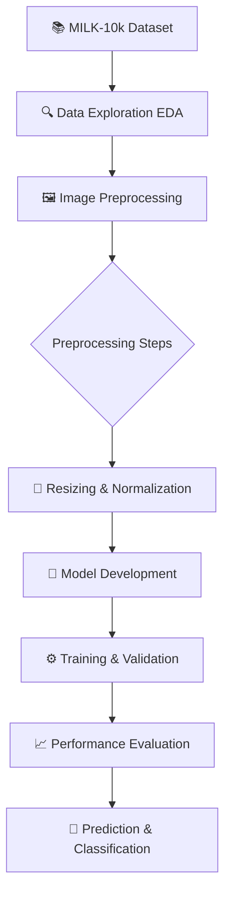

<div align="center">

# 🔬 Automatic Skin Cancer Detection

## *Multimodal Skin Lesion Image Analysis*


---

*A research project to develop a deep learning model capable of classifying skin cancer types from medical images.*

</div>

## 🎯 **Overview**

> This project aims to build an intelligent system that can **automatically detect and classify seven different types of skin lesions**, including malignant lesions such as Melanoma (MEL) and Basal Cell Carcinoma (BCC). By leveraging the **MILK-10k** multimodal image dataset, this system is designed to serve as a diagnostic support tool for medical professionals.

<table>
<tr>
<td width="50%">

### 📊 **Project Specifications**

- **📚 Dataset**: MILK-10k
- **🧠 Domain**: Medical AI, Computer Vision
- **🎯 Focus**: Skin Cancer Classification
- **🖼️ Total Images**: 10,000+
- **🐍 Libraries**: Pandas, Seaborn, Matplotlib, PIL
- **📓 Environment**: Jupyter Notebook

</td>
<td width="50%">

### 🔗 **Quick Links**

- 📂 **[Dataset Folder](dataset/)**
- 📓 **[Analysis Notebook (EDA)](main.ipynb)**
- 📝 **[Dependencies](requirements.txt)**
- 📜 **[MIT License](LICENSE)**

</td>
</tr>
</table>

---

## 📁 **Repository Structure**

```
📦 Automatic-Skin-Cancer-Detection/
├── 📂 dataset/
│   ├── 📂 MILK10k_Test_Input/
│   ├── 📂 MILK10k_Training_Input/
│   ├── 📄 MILK10k_Test_Metadata.csv
│   ├── 📄 MILK10k_Training_GroundTruth.csv
│   └── 📄 MILK10k_Training_Supplement.csv
│
├── 📓 main.ipynb               # Main notebook for EDA & Preprocessing
├── 📄 requirements.txt         # Python dependencies list
└── 📄 README.md                # This documentation
```

<div align="center">

### 🏗️ **Project Workflow**



</div>

## 📊 **Metadata Specifications (`GroundTruth.csv`)**

The metadata file contains labels for each image, encoded in *one-hot encoding* format.

<div align="center">
<table>
<thead>
<tr style="background: linear-gradient(45deg, #02aab0 0%, #00cdac 100%); color: white;">
<th>🏷️ Field</th>
<th>📝 Description</th>
<th>📄 Data Type</th>
<th>📊 Example Data</th>
</tr>
</thead>
<tbody>
<tr>
<td><strong>lesion_id</strong></td>
<td>Unique ID for each skin lesion</td>
<td>String</td>
<td>IL_0000000</td>
</tr>
<tr style="background-color: #f8f9fa;">
<td><strong>AKIEC</strong></td>
<td>Actinic Keratoses</td>
<td>Float (0.0/1.0)</td>
<td>1.0</td>
</tr>
<tr>
<td><strong>BCC</strong></td>
<td>Basal Cell Carcinoma</td>
<td>Float (0.0/1.0)</td>
<td>0.0</td>
</tr>
<tr style="background-color: #f8f9fa;">
<td><strong>BKL</strong></td>
<td>Benign Keratosis-like Lesions</td>
<td>Float (0.0/1.0)</td>
<td>0.0</td>
</tr>
<tr>
<td><strong>DF</strong></td>
<td>Dermatofibroma</td>
<td>Float (0.0/1.0)</td>
<td>0.0</td>
</tr>
<tr style="background-color: #f8f9fa;">
<td><strong>MEL</strong></td>
<td>Melanoma</td>
<td>Float (0.0/1.0)</td>
<td>0.0</td>
</tr>
<tr>
<td><strong>NV</strong></td>
<td>Melanocytic Nevi</td>
<td>Float (0.0/1.0)</td>
<td>0.0</td>
</tr>
<tr style="background-color: #f8f9fa;">
<td><strong>VASC</strong></td>
<td>Vascular Lesions</td>
<td>Float (0.0/1.0)</td>
<td>0.0</td>
</tr>
</tbody>
</table>
</div>

## 🚀 **Potential Applications**

<div align="center">
<table>
<tr>
<td align="center" width="25%">

<h4><strong>Diagnostic Support Tool</strong></h4>
<p><em>Assists dermatologists in early screening and identification of suspicious lesions.</em></p>
</td>
<td align="center" width="25%">

<h4><strong>Telemedicine Application</strong></h4>
<p><em>Integration into digital health platforms for remote consultations.</em></p>
</td>
<td align="center" width="25%">

<h4><strong>Medical Research</strong></h4>
<p><em>Foundation for analyzing skin disease trends and developing new detection methods.</em></p>
</td>
<td align="center" width="25%">

<h4><strong>Public Education</strong></h4>
<p><em>Raising public awareness about the importance of early skin cancer detection.</em></p>
</td>
</tr>
</table>
</div>

## 🛠️ **Methodology**

<div align="center">

### 🔄 **Data Preprocessing Pipeline**

```
📥 Raw Image Input → 🖼️ Resize → 🎨 Color Conversion → 🔢 Pixel Normalization → ✅ Training-Ready Output
```

</div>

> **Key Process**: Each image in the dataset undergoes a series of crucial preprocessing steps to ensure consistency and improve model performance. This process is standardized for all images, both clinical and dermoscopic.

<details>
<summary><strong>🔍 Preprocessing Steps Details</strong></summary>

- ✅ **Image Resizing**: All images are resized to uniform dimensions (e.g., 224x224 pixels) to meet model input requirements.
- ✅ **Color Conversion**: Ensures all images are in a consistent color format (RGB).
- ✅ **Pixel Normalization**: Image pixel values (originally 0-255) are normalized to a smaller range (e.g., 0-1) to stabilize the training process.

</details>

## 👤 **Researcher**

<div align="center">
<table>
<tr>
<td align="center" width="100%">

<br>
<strong>Bayu Ardiyansyah</strong>
</td>
</tr>
</table>
</div>

## 📜 **License**

<div align="center">

[](https://opensource.org/licenses/MIT)

</div>

> This project is licensed under the MIT License. You are free to use, modify, and distribute this code for any purpose, whether commercial or non-commercial.

<div align="center">

### 🤝 **Contributions & Feedback**

*This is an independent research initiative. Suggestions, criticisms, or collaboration opportunities are highly appreciated. Please open an issue or contact the researcher directly.*

---

<sub>🔬 **Disclaimer**: This system is a research support tool and **not** a substitute for professional medical diagnosis. All results provided by the model must be verified by qualified medical personnel.</sub>

</div>