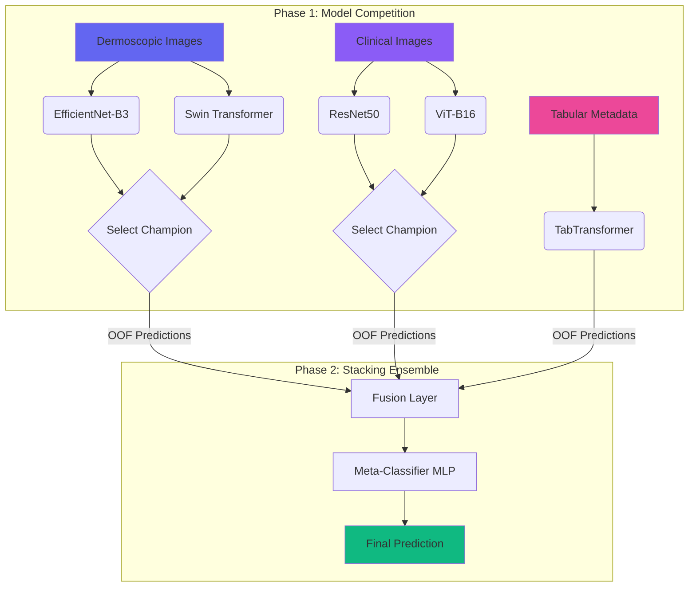

<div align="center">

# 🔬 MILKFusionNet

### *Multimodal Deep Learning Ensemble for Intelligent Skin Lesion Classification*


**[Dataset](https://challenge.isic-archive.com/data/#milk10k)** • **[Documentation](#-getting-started)** • **[Architecture](#-architecture)** • **[License](#-license)**

</div>

---

## 🎯 Overview

**MILKFusionNet** represents a cutting-edge approach to automated skin lesion classification, leveraging the power of multimodal deep learning. By harmoniously combining dermoscopic images, clinical photographs, and tabular metadata from the **ISIC MILK-10k** dataset, this system delivers enhanced diagnostic support for medical professionals.

> **Mission:** Democratizing early skin cancer detection through AI-powered precision, reducing diagnostic subjectivity, and bridging healthcare accessibility gaps worldwide.

---

## 💡 The Challenge

Skin cancer, particularly melanoma, remains a critical global health concern with high mortality rates when diagnosed late. Current diagnostic paradigms face several limitations:

<table>
<tr>
<td width="33%" align="center">

### 🎭 Subjectivity
Heavy reliance on dermatologist experience with limited availability in underserved regions

</td>
<td width="33%" align="center">

### 📊 Data Imbalance
Severe class imbalance in medical datasets causing model bias toward common conditions

</td>
<td width="33%" align="center">

### 🔍 Unimodal Limitations
Most AI systems analyze single image types, missing contextual clinical information

</td>
</tr>
</table>

---

## 🏗️ Architecture

MILKFusionNet employs a **two-phase ensemble strategy** that orchestrates multiple deep learning architectures:



### 🎨 Design Philosophy

| Component | Purpose | Technology |
|:----------|:--------|:-----------|
| **CNN Models** | Capture spatial hierarchies & local patterns | EfficientNet-B3, ResNet50 |
| **Transformers** | Model global context & long-range dependencies | Swin Transformer, ViT-B16 |
| **Tabular Model** | Process patient metadata & clinical markers | TabTransformer |
| **Meta-Learner** | Intelligent probability fusion & final decision | Multi-Layer Perceptron |

---

## 📂 Project Structure

```
📦 MILKFusionNet/
│
├── 📂 dataset/                      # Raw data (git-ignored)
│   ├── MILK10k_Test_Input/
│   └── MILK10k_Training_Input/
│
├── 📂 processed_data/               # Preprocessed datasets
│   └── train_processed.csv
│
├── 📂 notebooks/                    # Jupyter notebooks
│   └── main.ipynb                   # Main analysis pipeline
│
├── 📂 src/                          # Source code modules
│   ├── dataset.py                   # Dataset loaders
│   ├── model.py                     # Model architectures
│   └── utils.py                     # Utility functions
│
├── 📂 configs/                      # Configuration files
│   └── training_config.yaml
│
├── 📄 requirements.txt              # Python dependencies
├── 📄 LICENSE                       # MIT License
└── 📄 README.md                     # This file
```

---

## 🛠️ Methodology

### Preprocessing Pipeline

Our preprocessing strategy is meticulously designed based on empirical analysis:

<table>
<tr>
<th width="25%">Technique</th>
<th width="40%">Rationale</th>
<th width="35%">Implementation</th>
</tr>

<tr>
<td><b>🖼️ Resizing</b></td>
<td>Standardizes input dimensions for efficient batch processing</td>
<td><code>Resize(224, 224)</code></td>
</tr>

<tr>
<td><b>✨ CLAHE</b></td>
<td>Adaptive histogram equalization enhances local contrast</td>
<td><code>CLAHE(clip_limit=3.0)</code></td>
</tr>

<tr>
<td><b>🎲 Augmentation</b></td>
<td>Synthetic data diversity prevents overfitting</td>
<td><code>HorizontalFlip, Rotate, ColorJitter</code></td>
</tr>

<tr>
<td><b>📏 Normalization</b></td>
<td>Accelerates convergence & stabilizes training</td>
<td><code>Normalize(ImageNet stats)</code></td>
</tr>
</table>

### Training Strategy

- **Loss Function:** Focal Loss (γ=2, α=0.25) for severe class imbalance
- **Optimizer:** AdamW with weight decay (1e-4)
- **Scheduler:** ReduceLROnPlateau (patience=5, factor=0.5)
- **Cross-Validation:** 5-fold stratified CV for robust evaluation
- **Early Stopping:** Patience of 10 epochs on validation loss

---

## 🚀 Getting Started

### Prerequisites

```bash
Python 3.8+
PyTorch 2.0+
CUDA 11.8+ (recommended)
16GB+ RAM
```

### Installation

**1. Clone the repository**
```bash
git clone https://github.com/username/MILKFusionNet.git
cd MILKFusionNet
```

**2. Create virtual environment**
```bash
python -m venv venv
source venv/bin/activate  # On Windows: venv\Scripts\activate
```

**3. Install dependencies**
```bash
pip install -r requirements.txt
```

**4. Download dataset**
- Visit [ISIC MILK-10k Challenge](https://challenge.isic-archive.com/data/#milk10k)
- Extract files into `dataset/` directory

### Quick Start

**Run the complete pipeline:**
```bash
jupyter notebook notebooks/main.ipynb
```

**Or execute individual components:**
```python
from src.dataset import MILKDataset
from src.model import MILKFusionNet

# Load and preprocess data
dataset = MILKDataset(root='dataset/', transform=get_transforms())

# Initialize model
model = MILKFusionNet(num_classes=11)

# Train ensemble
model.fit(dataset, epochs=50, cv_folds=5)
```

---

## 📊 Expected Results

| Metric | Target | Clinical Significance |
|:-------|:------:|:---------------------|
| **Accuracy** | >85% | Overall diagnostic precision |
| **Balanced Accuracy** | >80% | Performance across rare classes |
| **Sensitivity (Melanoma)** | >90% | Critical for early cancer detection |
| **Specificity** | >88% | Reduces false positive burden |

---

## 🤝 Contributing

Contributions are welcome! Please follow these guidelines:

1. Fork the repository
2. Create a feature branch (`git checkout -b feature/AmazingFeature`)
3. Commit changes (`git commit -m 'Add AmazingFeature'`)
4. Push to branch (`git push origin feature/AmazingFeature`)
5. Open a Pull Request

---

## 👨‍🔬 Author

**Bayu Ardiyansyah**

[](https://github.com/username)
[](https://linkedin.com/in/username)
[](mailto:your.email@example.com)

---

## 📜 License

This project is licensed under the **MIT License** - see the [LICENSE](LICENSE) file for details.

---

## ⚠️ Disclaimer

<div align="center">

> **IMPORTANT:** MILKFusionNet is a research prototype and **NOT** a certified medical diagnostic tool. 
> 
> All predictions must be validated by qualified healthcare professionals. This system is designed to augment, not replace, clinical expertise.

</div>

---

<div align="center">

### 🌟 If you find this project useful, please consider giving it a star!

**Made with ❤️ for advancing healthcare AI**

</div>